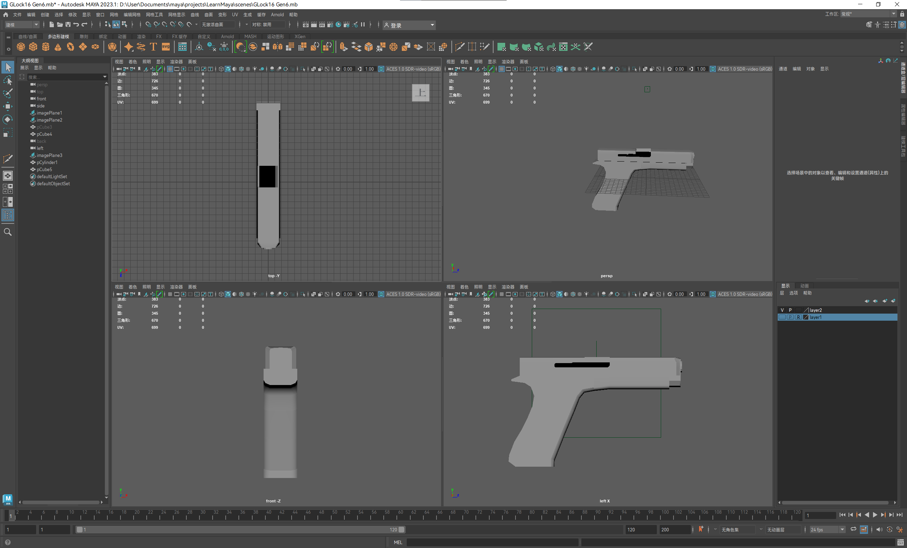
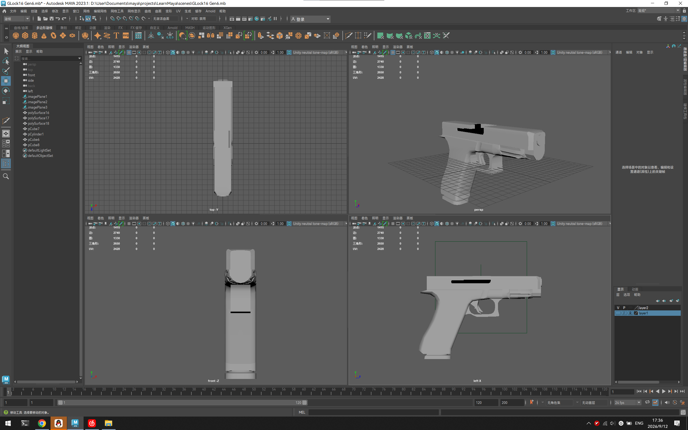
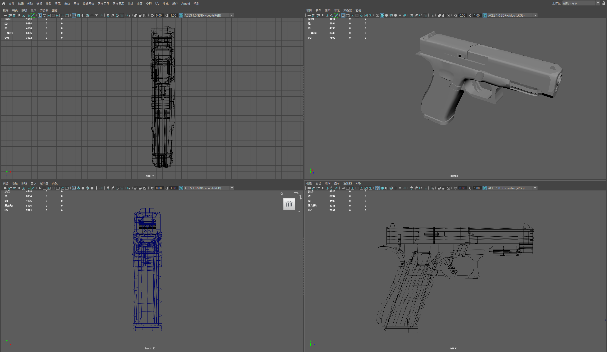

# Maya 场景建模

小猫猫徽章（个人完成）

风格：卡通 
面数：5246 
软件：MAYA, Arnold Renderer 

---

游戏控制器（个人完成）

风格：写实 
面数：10367 
软件：MAY，Blender Cycles Renderer 

--- 

格洛克17 6代手枪

| 建模阶段 | 面数（三角面） | 编辑界面                         |
| ---- |:-------:| ---------------------------- |
| 基础大型 | 670     |  |
| 低模细化 | 2650    |  |
| 低模完成 | 8336    |  |

